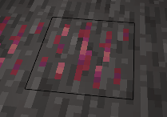
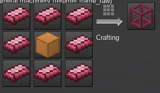
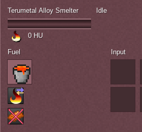
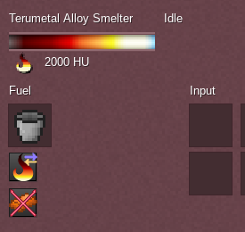
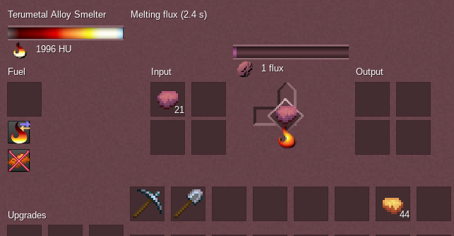
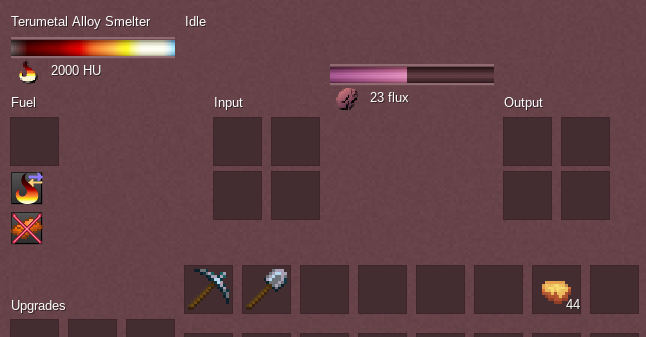
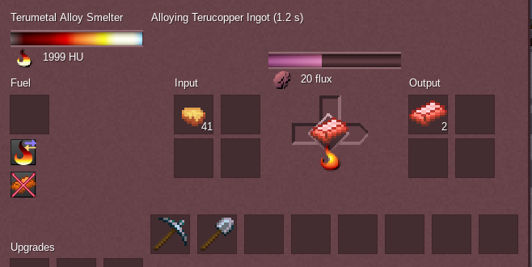

# Terumetal [terumet]
### Current release version: [v3.0](https://github.com/Terumoc/terumet/releases/tag/v3.0)
A mod for the open-source voxel game Minetest (https://www.minetest.net/)

This mod creates a new ore in the world which can be used to make useful alloys from many already available materials.

### Changelog
See the changelog [Here](changelog.md)

## Installing
Click the green "Clone or download" button above to get a ZIP file of the up-to-date work in progress version of the mod. If you want an older stable version, click the "releases" header.

Unzip the folder into a temporary space then move/copy the *subfolder* **terumet** into your minetest **mods** folder.

**The items outside of that folder are development files and are *not needed* to use the mod. They can be deleted after moving the "terumet" folder out.**

## Mod Dependencies
This mod depends on:
* minetest game "default" and many of its submods

All above mods should normally be included already if playing the default Minetest subgame.

Additonal *optional* support for:
* unified_inventory (**HIGHLY recommended**)
* techpack / tubelib
* 3d_armor
* mobs_animal (foods)
* bushes, dryplants, vines (crushing recipes)

Note: mesecons is listed as an optional dependent only for code to prevent Terumetal machines from being moved by mesecon pistons.

# Overview/Tutorial

## Worldgen
The only new thing generated in the world is a new type of ore:

Which can be found in stone or desert stone:

Like any other standard Minetest ore mining it provides you with one or more raw lumps of ore, which can be cooked in a furnace to create ingots.

Most tools made from pure Terumetal Ore will be very brittle and break quickly. In a pinch they *can* be useful since they are capable of digging very hard material quickly (and curiously, *ONLY* very hard material) but will only last a few blocks worth of digging.

## Alloy Smelter
The real use of Terumetal Ingots is creating an Alloy Smelter. First you'll need some intermediate materials that use them:

You'll need heating coils made from pure terumetal. Note that you'll get 8 from the recipe so you only need to do this once.

Additionally, you'll need a basic Terumetal Machine Frame like above. The copper block might seem out of place, but in the final machine it acts as a rudimentary 'battery' for the heat it uses to function. All Terumetal machinery runs on heat, so every machine frame has some sort of heat-storing element in the center.

Once you have both of these materials, you're ready to make the Alloy Smelter itself:

Place the smelter block down somewhere and you can then right-click it to access its interface like a standard furnace:

Before you begin using it it's important to understand two things about the Alloy Smelter:
1. It requires heat to function.
2. The flux metal used to alloy with other materials is melted first and stored inside.

One helpful thing to keep in mind is that unlike vanilla Minetest furnaces, all Terumetal machines will drop their contents when you break it and also will retain heat inside them (visible in the tool tip) for when you place them again. Specifically for the Alloy Smelter, any molten flux metal left in the internal tank will be dropped as crystallized Terumetal when broken and thus reusuable later just at the cost of the heat and time to re-melt.

### Heating Machinery
The starter method of heating is with a bucket of lava placed in the fuel slot of a machine. Your empty bucket will be returned.

Once up and running, you have many further options for how to heat machinery. The most straightforward is alloying **Thermese** and then making **Thermese Blocks** which can be an effective tool for renewable heating. Thermese Blocks can heat up when cooked in a standard furnace or when adjacent to a lava source, and then inserted into a machine to deposit its heat. You will receive the unheated block back, and can reuse it as many times as you like.

More high-powered and convenient methods of generating heat are through dedicated External Heater machines which build heat energy based on burning fuel (**Furnace Heater**), sunlight (**Solar Heater**), or the environment itself (**EEE Heater**).

There are three options for moving heat energy (HU, short for heat units) to machines that need it:
1. Shortest range: External Heaters will transfer heat to adjacent machines that need heat automatically. A **Thermal Distributor** will split one input into many adjacent machines, and a **Thermobox** can take many inputs to one output, as well as provide a large internal buffer for heat. In case this adjacent transfer is inconvenient, a button to toggle nearly every machine's ability to exchange heat adjacently is provided on their UI.
2. Short-medium range: **Heatline**s can transfer heat energy over a distance. Funnel heat energy into a **Heatline Distributor** and then machines connected to that distributor with heatlines will receive heat. These conduits can extend as far as 32 blocks from the distributor (by default settings).
3. Any range: The advanced **HEAT Ray Emitter** can send large bursts of heat energy through the air to an accepting machine it strikes with its beam.

### Flux Metal
The Terumetal Alloy Smelter is a specialized smelter only for making alloys, all but one of which require terumetal. Therefore it has an internal tank especially for molten Terumetal. This tank is the meter in the center indicated by a pink ore symbol. It can be filled by inserting raw terumetal in any form then waiting a few seconds for each item to melt. Naturally, this process requires heat and some will be spent by how much flux is melted.

(some time later...)

When processing materials for alloying a specific amount of molten flux will need to be in the tank to create the alloy. If not enough is present, it will indicate so and how much more is required until alloying can begin.

## Alloys
In total there are five alloys the smelter can create all based on Terumetal and other materials available in the default Minetest game world. Each of them can be used to create hardened metal blocks and tools of considerable speed and durability. Each alloy has much greater tool performance than any of their constituent materials.

(new in v1.3) If you have the mod unified_inventory installed, you can look up the names of these alloys and view the recipes in-game.

| Material | Flux/Ingot* | Time* | Alloy |  |
|----------------------------|-------------|---------|------------|----------------------|
| Copper Lump | 1 | 3 sec. | Terucopper |  |
| Tin Lump | 1 | 2 sec. | Terutin |  |
| Iron Lump | 2 | 4 sec. | Terusteel |  |
| Gold Lump | 3 | 4 sec. | Terugold |  |
| Bronze Ingot + 2 Tin Lumps | 3 | 4.5 sec. | Teruchalcum |  |
| Diamond + Obsidian Shard | 5 | 10 sec. | Coreglass |  |

*note: Flux required and time shown are default and can be modified in options.lua.

Like melting flux, creating an alloy requires heat. The amount of heat required is dependent on how long the alloying process takes; therefore, the alloys that require more time also require more heat.

Each of the four alloys can also be created in block form by inserting a block of the source material -- a Copper Block instead of a Copper Lump or a Diamond Block and Obsidian Block for Coreglass -- alloying an entire block will take longer along with the required preperation of making the blocks but will consume quite a bit less flux than doing them individually.

To create an alloy simply place the source materials into the input, and if there's enough molten flux all that's left is to wait. If an insufficient amount of flux is in the internal tank the smelter will indicate how much additional flux is required.

## Options
See options.lua for many, many ways to adjust or alter how machines function and recipes for creating items.
