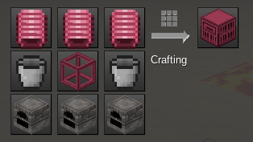
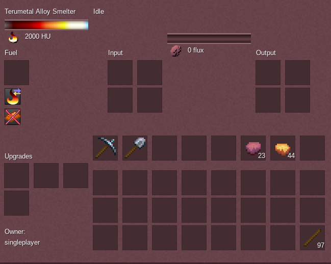

# Terumetal [terumet]
### Current release version: v1.5
A mod for the open-source voxel game Minetest (https://www.minetest.net/)

Creates a new ore in the world which can be used to make useful alloys from many already available materials.

### Changelog
See the changelog [Here](changelog.md)

## Installing
Download the working v1.5 release from [Here](https://github.com/Terumoc/terumet/releases/tag/v1.5)
or the current repo version [Here](https://github.com/Terumoc/terumet/archive/master.zip) (may NOT be functional).

Unzip the folder into a temporary space then move/copy the subfolder **terumet** into your minetest **mods** folder.

The items outside of that folder are development files and are *not needed* to use the mod.

## Mod Dependencies
This mod depends on:
* default
* bucket

Both mods should normally be already included if playing the default Minetest subgame.

Additonal **optional** support for:
* unified_inventory

# Overview/Tutorial

(Images are from v1.0 and may not be entirely accurate. The information continues to be, however.)

## Worldgen
The only new thing generated in the world is a new type of ore:

Which can be found in stone or desert stone:

Like any other standard Minetest ore mining it provides you with one or more raw lumps of ore, which can be cooked in a furnace to create ingots.

Do not make too many ingots from this new ore though because it is much better used as a flux for alloying than by itself; most tools made from raw Terumetal Ore will be very brittle and break quickly. In a pinch they *can* be useful since they are capable of digging very hard material quickly (and curiously, *ONLY* very hard material) but will only last a few blocks worth of digging.

## Alloy Smelter
The real use of Terumetal Ingots is creating an Alloy Smelter:

| Recipe items |-|-|
|-----------------|-----------|---------------|
| Terumetal Ingot | Furnace | Terumetal Ingot |
| Empty Bucket | Copper Block | Empty Bucket |
| Terumetal Ingot | Furnace | Terumetal Ingot |

Place the smelter block down somewhere and you can then right-click it to access its interface like a standard furnace:

Before you begin using it it's important to understand two things about the Alloy Smelter:
1. It requires heat to do anything.
2. The flux metal used to alloy with other materials is melted first and stored inside.

One helpful thing to keep in mind is that unlike vanilla Minetest furnaces the Terumetal Alloy Smelter *will* drop its contents when you break it. The only thing lost is any stored heat which will evaporate into the atmosphere. Also, thanks to some form of instant heat transfer technology any molten flux metal left in the internal tank will be dropped as raw lumps of Terumetal, reusuable again later just at the cost of the heat and time to re-melt them.

### Heating the Alloy Smelter
The simplest way to get lots of heat quickly is with lava and that is how the Smelter is heated.
When cold, the smelter displays its fuel slot in the upper-right corner and is expecting a bucket of lava to be inserted into it.

Once inserted, the heat level will reflect the bucket-worth of lava now inside the machine by filling the heat bar and your empty bucket will be refunded in the output section.

A single bucket of lava provides enough heat to operate for quite a while, but not forever. When the heat from the lava is fully dissipated, the fuel slot will reappear with the remaining cobblestone from the lava and any processing will stop until a new bucket of lava is inserted.

In quite a user-friendly manner the smelter is amazingly heat efficient and none will be lost except by doing processing functions or by breaking the smelter itself.

### Flux Metal
The Terumetal Alloy Smelter is a specialized smelter only for making alloys from combining Terumetal and other materials, therefore it has an internal tank especially for molten Terumetal. This tank is the meter in the center of the screen to the left. It can be filled by inserting raw lumps of Terumetal into the input slot (*not* ingots) then waiting a few seconds for each lump to melt. Naturally, this process requires heat and some will be spent by how much flux is melted.

(some time later...)

When processing materials for alloying a specific amount of molten flux will need to be in the tank to create the alloy. If not enough is present, it will indicate so and how much more is required until alloying can begin.

## Alloys
In total there are four alloys the smelter can create all based on Terumetal and other materials available in the default Minetest game world. Each of them can be used to create hardened metal blocks and tools of considerable speed and durability. Each alloy has much greater tool performance than any of their constituent materials.

(new in v1.3) If you have the mod unified_inventory installed, you can look up the names of these alloys and view the recipes in-game.

| Material | Flux/Ingot* | Time* | Alloy |  |
|----------------------------|-------------|---------|------------|----------------------|
| Copper Lump | 1 | 3 sec. | Terucopper |  |
| Iron Lump | 2 | 4 sec. | Terusteel |  |
| Gold Lump | 3 | 5 sec. | Terugold |  |
| Diamond and Obsidian Shard | 5 | 10 sec. | Coreglass |  |

*note: Flux required and time shown are default.

Like melting flux, creating an alloy requires heat. The amount of heat required is dependent on how long the alloying process takes; therefore, the alloys that require more time also require more heat.

Each of the four alloys can also be created in **block form** by inserting a block of the source material -- a Copper Block instead of a Copper Lump or a Diamond Block and Obsidian Block for Coreglass -- alloying an entire block will take longer along with the required preperation of making the blocks but will consume quite a bit less flux than doing them individually.

To create an alloy simply place the source materials into the input, and if there's enough molten flux all that's left is to wait. If an insufficient amount of flux is in the internal tank the smelter will indicate how much additional flux is required.

## Options
See options.lua for some ways to modify how the alloying process works.
